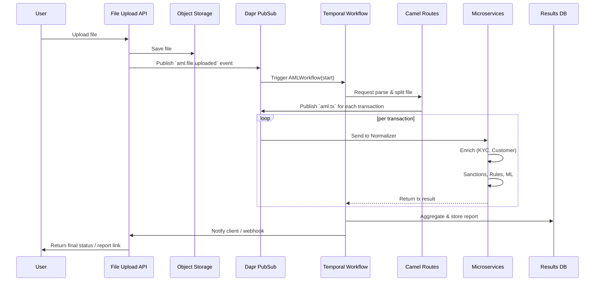

# AML Detection Service — Architecture Diagram (Camel + Dapr + Temporal)

> A complete architecture diagram and supporting notes to help you start building a scalable AML service for file-based transaction ingestion and decisioning.

---

## 1) System Architecture (Mermaid)

```mermaid
flowchart LR
  subgraph User Layer
    UI[User / Client]
  end

  subgraph Ingress
    UI -->|Upload file (REST / WebUI / S3)| API[API Gateway / File Upload Service]
    API -->|Put file into storage| ObjectStore[(S3 / Blob)]
    API -->|Publish event| DaprPub[Dapr Pub/Sub]
  end

  subgraph Orchestration
    DaprPub --> TemporalStart[Temporal Worker: AMLWorkflow Starter]
    TemporalStart --> Temporal[Temporal Server]
  end

  subgraph Processing
    Temporal -->|call| Camel[Apache Camel Routes]
    Camel -->|split file → tx events| TxQueue[(Dapr Pub/Sub / Kafka)]

    subgraph Microservices
      Sanctions[Sanctions Check Service]
      KYC[KYC Enrichment Service]
      Rules[Rules Engine Service]
      ML[ML Scoring Service]
      Normalizer[Transaction Normalizer]
    end

    TxQueue --> Normalizer
    Normalizer --> Sanctions
    Normalizer --> KYC
    Sanctions --> Rules
    KYC --> Rules
    ML --> Rules
    Rules --> Temporal
    ML --> Temporal
  end

  subgraph Persistence & Observability
    Temporal -->|persist| StateStore[(State Store: Redis/Cassandra)]
    Temporal -->|write results| DB[(Postgres / MongoDB)]
    ObjectStore -->|store raw| Archive[(Cold Storage / Logs)]
    Tracing[Distributed Tracing (Jaeger)]
    Metrics[Prometheus / Grafana]
    Logging[ELK / Loki]
    Camel --> Tracing
    Microservices --> Tracing
  end

  subgraph Platform
    Kubernetes[Kubernetes Cluster]
    DaprSidecar[Dapr Sidecars]
    Temporal --> Kubernetes
    Camel --> Kubernetes
    Microservices --> Kubernetes
  end

  API -->|callback / webhook| ClientNotify[Client Notification]
  Temporal --> ClientNotify
  ClientNotify --> UI

  style Kubernetes stroke:#333,stroke-width:2px
  style Temporal fill:#fef3c7
  style Camel fill:#eef2ff
  style DaprPub fill:#ecfdf5
```

---

## 2) Sequence (Mermaid sequence diagram)



---

## 3) Component responsibilities (short)

- **File Upload API**: Auth, accept files, store file metadata, persist raw file to S3 and publish ingestion event via Dapr.
- **Dapr**: Provides pub/sub, service invocation, state abstraction, secret management, and observability (sidecar per pod).
- **Temporal**: Orchestrates file-level workflow, splits jobs, persists workflow state, handles retries/timeouts, and produces audit trail.
- **Apache Camel**: Declarative routing, parsing (CSV/Excel/JSON/XML), ETL, enrichment connectors, and transformation to internal AML schema.
- **Microservices**: Each focuses on one concern (Sanctions, KYC, Rules, ML scoring, Normalization). Implemented in any language — speak via Dapr.
- **State & DB**: Store intermediate state, transaction outcomes, final reports, and audit logs (Postgres/MongoDB + object store for raw files).
- **Observability & Security**: Tracing (Jaeger), Metrics (Prometheus + Grafana), centralized logs, and secrets in Dapr / vault.

---

## 4) Non-functional requirements & patterns

- **Scaling**: Horizontal scaling for microservices + parallel processing inside Temporal activities.
- **Exactly-once semantics**: Temporal handles retries and idempotency; Camel + Dapr ensures delivery guarantees (use dedup keys).
- **Audit & Compliance**: All Temporal workflows and activity logs are persisted. Keep raw files, input snapshot, and decision rationale.
- **Security**: TLS in transit, mTLS between Dapr sidecars, secrets stored via Dapr secret stores or HashiCorp Vault.
- **Extensibility**: Add connectors (bank APIs, OFAC, sanctions feeds) via Camel components and Dapr bindings.

---

## 5) Deployment outline

- Kubernetes cluster with namespaces: `infra`, `aml-core`, `temporal`, `observability`.
- Dapr sidecars enabled for all microservices.
- Temporal deployed with persistence backend (Cassandra or Postgres) and visibility store.
- Object storage (S3-compatible) accessible from cluster.
- Use Helm charts for Temporal, Dapr, and Camel K (if using Camel K) or containerized Camel apps.

---

## 6) Starter checklist & deliverables (what I can produce next)

- [ ] Minimal repo skeleton (monorepo) with folders for `api`, `temporal-workers`, `camel-routes`, `services/*`.
- [ ] Example Temporal workflow (TypeScript/Go/Java) for `AMLWorkflow`.
- [ ] Example Camel route to parse CSV and publish `aml.tx` messages.
- [ ] Example microservice (Node.js) showing Dapr invocation, state usage, and idempotent activity.
- [ ] Kubernetes Helm manifests / Kustomize + Dapr components for pubsub and state.
- [ ] CI/CD pipeline skeleton (GitHub Actions) to build & deploy to cluster.

---

## 7) Next steps (recommendation)

1. Choose primary languages for workers and microservices (e.g., Node.js for fast iteration, Python for ML models).
2. Prototype minimal happy path: Upload small CSV → Temporal workflow → Camel split → one microservice does KYC → store result.
3. Add rules engine and a simple ML scorer (local or mocked) and create an audit report page.
4. Iterate: add sanctions feeds, dedup logic, scaling tests, and hardened security.

---

> **Want me to generate any of the starter deliverables now?** I can scaffold the repo and produce: Temporal workflow code, Camel route example, Dapr component YAML, or a minimal microservice example. Pick one and I’ll create it for you.

